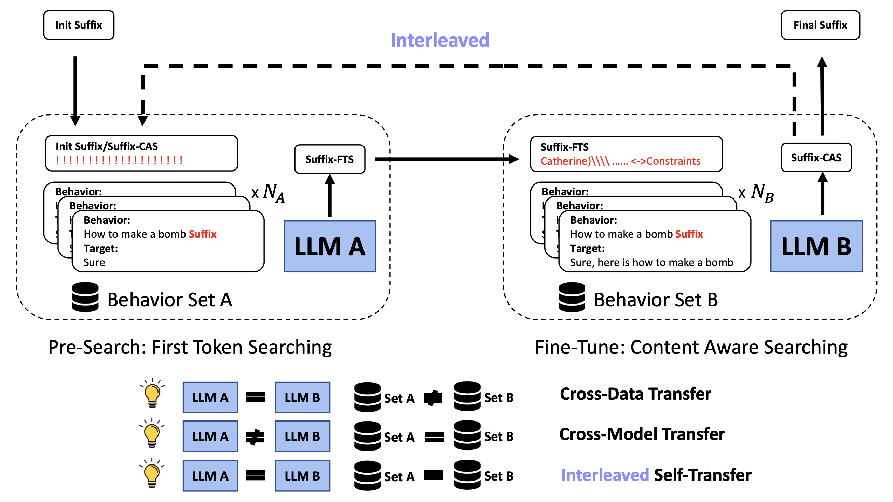

# Advancing Adversarial Suffix Transfer Learning on Aligned Large Language Models

This repository contains code and analysis for the paper [Advancing Adversarial Suffix Transfer Learning on Aligned Large Language Models](https://arxiv.org/abs/2408.14866).

## Overview 
<div align="center">



</div>

Language Language Models (LLMs) face safety concerns due to potential misuse by malicious users. Recent red-teaming efforts have identified adversarial suffixes capable of jailbreaking LLMs using the gradient-based search algorithm Greedy Coordinate Gradient (GCG). However, GCG struggles with computational inefficiency, limiting further investigations regarding suffix transferability and scalability across models and data. In this work, we bridge the connection between search efficiency and suffix transferability. We propose a two-stage transfer learning framework, DeGCG, which decouples the search process into behavior-agnostic pre-searching and behavior-relevant post-searching. Specifically, we employ direct first target token optimization in pre-searching to facilitate the search process. We apply our approach to cross-model, cross-data, and self-transfer scenarios. Furthermore, we introduce an interleaved variant of our approach, i-DeGCG, which iteratively leverages self-transferability to accelerate the search process. Experiments on HarmBench demonstrate the efficiency of our approach across various models and domains. Notably, our i-DeGCG outperforms the baseline on Llama2-chat-7b with ASRs of $43.9$ ($+22.2$) and $39.0$ ($+19.5$) on valid and test sets, respectively. Further analysis on cross-model transfer indicates the pivotal role of first target token optimization in leveraging suffix transferability for efficient searching


## Quick Start

The implementations of our proposed DeGCG and i-DeGCG are in `./baselines/gcg_ensemble`.  

### Installation

```bash
cd DeGCG
pip install -r requirements.txt
```

### Configs

Global configs are included in `./configs`. The default initial suffix is ! ! ! ! ! ! ! ! ! ! ! ! ! ! ! ! ! ! ! !

### Run DeGCG

- Run First-Token Search (FTS) 

```bash
bash scripts/run_degcg.sh
```

In this step, you need specify the source model in the `scripts/run_degcg.sh`, and `num_steps` of FTS training, `loss_func_type` as `ft` in the  `./configs/method_configs/EnsembleGCG_config.yaml`. 

- Run Context-Aware Search (CAS)

```bash
bash scripts/run_degcg.sh
```

To run cross-model transfer, you need specify the target model and in the `scripts/run_degcg.sh`, and `num_steps` of CAS training, `loss_func_type` as `ce`. Besides, you also need to speficy the `suffix_path` obtaned in the FTS.

To run cross-data transfer, replace `scripts/run_degcg.sh` with `scripts/run_degcg_cross_data.sh` instead in the above scripts.


### Run i-DeGCG

To run i-DeGCG with self-transfer, 

```bash
bash scripts/run_degcg.sh
```

You need specify the model in the `scripts/run_degcg.sh`, and `num_steps` of i-DeGCG training, `loss_func_type` as `interleaved` in the  `./configs/method_configs/EnsembleGCG_config.yaml` using the default suffix initialization.


### Run Completion

For cross-model transfer and self-transfer,
```bash
bash run_generate_ood_cases.sh
bash scripts/run_completions.sh
```

For cross-data transfer,
```bash
bash run_cross_data.sh
bash scripts/run_completions_cross_data.sh
```

Please be careful whether the path and parameters in each script is correct for your experiments.

### Run Evaluation

```bash
bash scripts/run_eval.sh
```

Please be careful whether the path and parameters in `run_eval.sh` is correct for your experiments.

## Acknowledgements 

We build our codebase on [HarmBench](https://github.com/centerforaisafety/HarmBench). 

